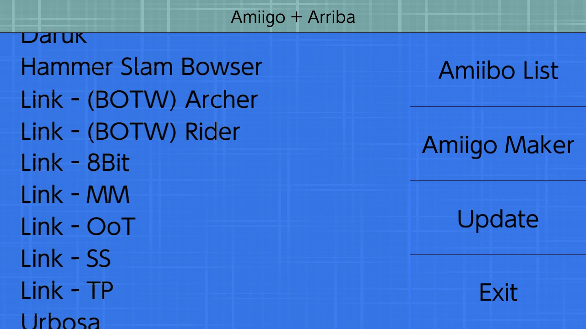

# Amiigo

   

Amiigo is an application for creating and switching virtual Amiibo for use with the [Emuiibo](https://github.com/XorTroll/emuiibo) system module. Amiigo runs entirely on the Nintendo Switch console and no PC is required for setup. A Nintendo Switch with custom firmware is required to use Amiigo, [see here for more info](https://switch.hacks.guide/).

All Amiibo data is obtained from the [AmiiboAPI](https://www.amiiboapi.com/) and the [emutool](https://github.com/XorTroll/emuiibo/tree/master/emutool) source code was referenced extensively to understand how virtual Amiibo generation works.

Amiigo is built with the [Arriba](https://github.com/CompSciOrBust/Arriba) UI framework, which was designed with Amiigo in mind.

   
   

### Quick Links

   * [Usage](#Usage)
   * [Support](#Support)
   * [Building](#Building)
   * [Credits](#Credits)
   * [Donating](#Donating)

### Screenshots

   
   

## Usage

The right hand side of the user interface has several tabs for switching between modes.

### Amiibo List
The "Amiibo List" tab is the default tab upon opening the app and is used for selecting which Amiibo to emulate.

### Amiigo Store
The "Amiigo Store" tab is used to generate virtual Amiibo files. Any Amiibos generated in this mode will show up in the Amiibo List tab. First, select a category from the listed games, then select which Amiibo from that category you wish to generate.

### Settings / Update
The "Settings" tab can be used to configure how Amiigo works and to update the Amiigo app. Note that when an update is available for the Amiigo app this tab will automatically change from "Settings" to "Update".

The "Update Amiigo" button can be used to download the latest version of Amiigo within the app. This button will only be visible when an update is available.

The "Save to X" button is used to configure which folder virtual Amiibos are saved to. This changes how Amiibos appear in the Amiibo list. Possible options are:
* Root
* Game name
* Amiibo Series
* Current folder

The "Enable random UUID" / "Disable random UUID" button configures if Amiibos are generated using a static identifier or an identifier which changes after each Amiibo use. For most users it is recommended to leave this as the default.

### Controls

Controlling the app should be intuitive for anyone who has used Nintendo Switch software before. Amiigo fully supports touchscreen use whilst the Nintendo Switch is in handheld mode.

The direction pad and analog sticks can be used to move between buttons and other UI elements.

The A button is used to activate the UI element's primary function.

The Y button is used to activate the UI element's secondary function, if a secondary function is supported. This can also be done by long-pressing the touchscreen.

The X button can be used to enable and disable the Emuiibo system module. This is only recommended for advanced users since enabling emulation is handled automatically by the app.

The B button goes back or exits a submenu.

## Support

For support please use [the official GBATemp thread](https://gbatemp.net/threads/amiigo-emuiibo-gui.549964/) unless you are reporting a bug in which case open an issue here on GitHub. Alternatively join [my Discord server](https://discord.gg/ZhRn3nn).

## Building

Install [LibNX](https://switchbrew.org/wiki/Setting_up_Development_Environment).

Recursively clone this repo.

Run (dkp-)pacman -S switch-glfw

Run (dkp-)pacman -S switch-glad

Run (dkp-)pacman -S switch-curl

Run Make

Optionally run "nxlink -s Amiigo.nro" after opening NetLoader to get debugging info.

## Credits

[XorTroll](https://github.com/XorTroll/) for [Emuiibo](https://github.com/XorTroll/emuiibo) and general help.

[N3evin](https://github.com/N3evin/) for [AmiiboAPI](https://github.com/N3evin/AmiiboAPI) which is used in Amiigo Store.

nlohmann for his [JSON library](https://github.com/nlohmann/json).

[Kronos2308](https://github.com/Kronos2308/) for maintaining Amiigo Mod.

Victoria_Borodinova for the [sombrero](https://pixabay.com/illustrations/sombrero-hat-mexico-mexican-4280389/) used in the logo.

Za for bringing pizzas.

All of the beta testers in the [CompSciOrBust Discord server](https://discord.gg/ZhRn3nn).

[hazelwiss](https://github.com/hazelwiss) for providing much useful programming advice.

## Donating
Before donating to a homebrew developer, consider donating to a charity instead.
|Method|Info
|--|--|
|BTC|bc1qdr7nd8kpkuhamd0cugs763y5vfzx73la8as2ms|
